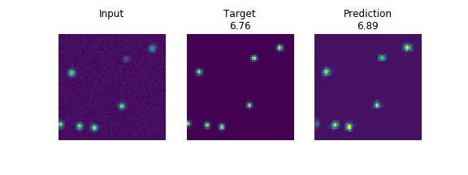
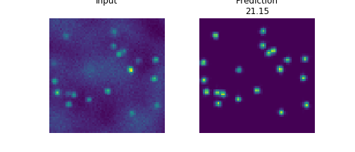

# DEFCoN

- [](https://travis-ci.org/LEB-EPFL/DEFCoN)
- [](https://gitter.im/leb_epfl/DEFCoN?utm_source=badge&utm_medium=badge&utm_campaign=pr-badge&utm_content=badge)

Density Estimation by Fully Convolutional Networks (DEFCoN) - A
fluorescent spot counter for single molecule localization microscopy.

## Description

DEFCoN is a fluorescent spot counter implemented as a fully
convolutional neural network. It is designed with the following
criteria in mind:

- Fast enough for real-time analysis (~10 ms per frame)
- Parameter free predictions
- Trainable on custom datasets
- Simple API




## Installation

### Requirements

Please see the setup.py file for the full list of required
packages. Specifically, the trained DEFCoN model requires a combination of
Python 3.6, TensorFlow 1.3.0, and Keras 2.0.8.

A combination of Python 3.5, TensorFlow 1.4.1, and Keras 2.1.1 is known to work
for training new DEFCoN networks.

### DEFCoN

To install DEFCoN, clone this repository and then use the following
command from inside DEFCoN's parent directory (the one above the
cloned repository):

```
pip install DEFCoN
```

If you wish to develop DEFCoN, we recommend installing as a
development package:

```
pip install -e DEFCoN
```

### Installing tensorflow-gpu (optional, but recommended)

The steps required to set up TensorFlow to use the GPU vary widely
depending on your system and your Python environment. We recommend
reading the following directions for installing TensorFlow to ensure
that it is properly configured to use your system's GPU in your
particular environment:
https://www.tensorflow.org/install/install_linux

In particular, we use the following commands from within a Python
virtual environment **after we have already installed DEFCoN.**

```
pip uninstall tensorflow
pip install --ignore-installed --upgrade tensorflow-gpu==1.3.0
```

For us, uninstalling the CPU version of TensorFlow before installing
the GPU version is necessary to successfully detect the GPU.

You may verify that TensorFlow successfully detects your GPU after
setup by running the following commands from within your Python
interpreter:

```python
from tensorflow.python.client import device_lib
print(device_lib.list_local_devices())
```

If you see a string containing something similar to **name:
"/device:GPU:0" device_type: "GPU"** that is printed to the screen,
then you should be good to go.

## Quickstart

### Density Map Prediction

```python
import pkg_resources
from defcon.networks import FCN

# Obtain the filename for the saved DEFCoN model and load it
defcon_model = pkg_resources.resource_filename('defcon.resources', 'defcon_tf13.h5')
model = FCN.from_file(defcon_model)


# Predict from a TIF image stack
tif_file = 'path/to/tif/stack.tif'
y_pred = model.predict_tiff(tif_file)
```

### Further Examples

More detailed descriptions on how to perform density map estimations and how
to train your own DEFCoN network are found in the [examples folder](https://github.com/LEB-EPFL/DEFCoN/tree/master/examples).

## Getting Help

- How to use DEFCoN: https://gitter.im/leb_epfl/DEFCoN
- Bug reports: https://github.com/LEB-EPFL/DEFCoN/issues
- Feature requests: https://github.com/LEB-EPFL/DEFCoN/issues
- Developer questions: https://gitter.im/leb_epfl/DEFCoN

## Acknowledgements

DEFCoN was written by [Baptiste Ottino](https://github.com/bottino) as
a Master's thesis project under the guidance of [Kyle
M. Douglass](https://github.com/kmdouglass) and Suliana Manley in the
[Laboratory of Experimental Biophysics.](https://leb.epfl.ch)

### Software

- [TensorFlow](https://www.tensorflow.org/)
- [Keras](https://keras.io/)
- [NumPy](http://www.numpy.org/)
- [h5py](http://www.h5py.org/)
- [Jupyter](https://jupyter.org/)
- [scikit-image](http://scikit-image.org/)
- [tifffile](https://pypi.python.org/pypi/tifffile)
- [Pandas](https://pandas.pydata.org/)
 
